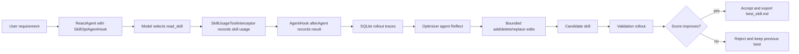

# Skill Auto Optimize Starter Implementation Plan

> **For agentic workers:** REQUIRED SUB-SKILL: Use superpowers:subagent-driven-development (recommended) or superpowers:executing-plans to implement this plan task-by-task. Steps use checkbox (`- [ ]`) syntax for tracking.

**Goal:** Add a Spring Boot starter that observes skill usage, records rollout evidence, lets a separate optimizer agent propose bounded SKILL.md edits, validates candidates on held-out tasks, and exports only the accepted `best_skill.md`.

**Architecture:** The primary integration should be based on the Spring AI Alibaba agent framework `Hook` / `Interceptor` layer, not a pure Spring AI `Advisor` or business annotation. `ToolInterceptor` observes `read_skill` calls, `AgentHook` captures the user requirement and final result, and an offline optimizer service performs Reflect/Edit/Gate/Export without adding inference-time model calls.

**Tech Stack:** Java 21, Spring Boot 3.5.x, Spring AI Alibaba agent framework, `SkillRegistry`, `SkillsAgentHook`, `ToolInterceptor`, `ModelInterceptor`, SQLite trace storage, filesystem skill versioning.

---

## 1. Integration Decision

### Recommendation

Use **agent hook + tool/model interceptor** as the main implementation.

The current sample uses:

```java
SkillRegistry skillsMarkdown = ClasspathSkillRegistry.builder()
        .classpathPath("skills")
        .build();

SkillsAgentHook skillsHook = SkillsAgentHook.builder()
        .skillRegistry(skillsMarkdown)
        .build();

ReactAgent agent = ReactAgent.builder()
        .name("skills-agent")
        .model(chatModel)
        .hooks(List.of(skillsHook))
        .build();
```

In this path, the agent framework provides these confirmed extension points:

- `SkillsAgentHook`: registers the `read_skill` tool and injects `SkillsInterceptor`.
- `ReadSkillTool.READ_SKILL`: skill usage is visible as a tool call named `read_skill`.
- `ToolInterceptor`: receives tool name, arguments, response, runtime config, and overall state.
- `AgentHook.beforeAgent` / `AgentHook.afterAgent`: captures run-level input and final output.
- `ModelInterceptor`: optionally captures model requests/responses and token usage evidence.

So the starter should provide a `SkillOptAgentHook` that wraps/delegates `SkillsAgentHook` and adds trace interceptors.

### Why Not Advisor as the Main Path

`SpringAiSkillAdvisor` is useful for ChatClient-only scenarios because it injects skill metadata into the system prompt. However, it does not own the `ReactAgent` tool execution loop. For the current sample, it cannot reliably capture:

- whether the agent actually called `read_skill`
- which skill was read
- the full tool response returned to the model
- the final agent result bound to that skill usage
- tool errors and retry evidence

Advisor support can be added as a compatibility mode later, but it should not be the core implementation for this starter.

### Why Not Annotation as the Main Path

Annotations are too manual for the requirement "调用 skill 了就监控到". They only work when application code marks the correct method or task boundary. They miss automatic skill reads inside the agent loop.

Annotations can still be optional metadata helpers:

- `@SkillOptDataset("coding")`
- `@SkillOptScore("exact-match")`
- `@SkillOptIgnore`

But they should not be required to detect skill usage.

## 2. Target User Experience

### Minimal Agent Usage

```java
SkillRegistry skillRegistry = ClasspathSkillRegistry.builder()
        .classpathPath("skills")
        .build();

SkillOptAgentHook skillOptHook = SkillOptAgentHook.builder()
        .skillRegistry(skillRegistry)
        .build();

ReactAgent agent = ReactAgent.builder()
        .name("skills-agent")
        .model(chatModel)
        .hooks(List.of(skillOptHook))
        .build();
```

This preserves the existing sample shape. The only visible change is replacing `SkillsAgentHook` with `SkillOptAgentHook`.

### Optimizable Filesystem Skill Usage

Classpath skills are read-only after packaging, so optimization should require a writable skill repository:

```java
SkillRegistry skillRegistry = FileSystemSkillRegistry.builder()
        .projectSkillsDirectory("./skills")
        .build();

SkillOptAgentHook skillOptHook = SkillOptAgentHook.builder()
        .skillRegistry(skillRegistry)
        .skillWorkspace("./.skillopt")
        .build();
```

Observation can work with any `SkillRegistry`. Editing/export should only be enabled when the starter can resolve a writable skill path.

### Spring Boot Configuration

```yaml
skill-opt:
  enabled: true
  mode: observe
  trace:
    database: ./.skillopt/skillopt.db
    include-model-messages: true
    include-tool-results: true
  optimize:
    enabled: false
    workspace: ./.skillopt
    reflection-cases: ./.skillopt/cases/reflection.jsonl
    validation-cases: ./.skillopt/cases/validation.jsonl
    min-improvement: 0.02
    max-edit-operations: 8
    max-skill-bytes: 64000
    slow-update:
      enabled: true
      min-observations: 20
      cooldown: PT6H
```

Default mode should be `observe`, not `optimize`, to avoid unexpected skill file writes.

## 3. End-to-End Flow



## 4. Evidence Captured Per Rollout

Each agent run should produce one run record and zero or more skill usage records.

### Run Record

```json
{
  "traceId": "20260605-153000-abc123",
  "agentName": "skills-agent",
  "threadId": "thread-1",
  "requirement": "请介绍你有哪些技能",
  "startedAt": "2026-06-05T15:30:00+08:00",
  "completedAt": "2026-06-05T15:30:04+08:00",
  "finalAnswer": "我可以使用...",
  "score": null,
  "status": "completed"
}
```

### Skill Usage Record

```json
{
  "traceId": "20260605-153000-abc123",
  "toolCallId": "call_x",
  "toolName": "read_skill",
  "skillName": "coding/coding",
  "skillPath": "./skills/coding",
  "skillHash": "sha256:...",
  "arguments": "{\"skill_name\":\"coding/coding\"}",
  "skillContentSnapshot": "optional content snapshot or hash only",
  "resultStatus": "success",
  "durationMillis": 18
}
```

### Model Evidence

Model evidence should be configurable because prompts can be large or sensitive:

- enabled by default in tests and offline rollouts
- disabled or redacted in production unless explicitly configured
- stores messages, tool-call choices, token usage, and model name if available

## 5. Starter Components

### Package Layout

Create these files under `autoskill/skill-opt-spring-boot-starter/src/main/java/top/egon/skillopt/`:

- `autoconfigure/SkillOptAutoConfiguration.java`
- `autoconfigure/SkillOptProperties.java`
- `hook/SkillOptAgentHook.java`
- `hook/SkillOptAgentHookBuilder.java`
- `trace/SkillOptTraceContext.java`
- `trace/SkillOptTraceRecorder.java`
- `trace/SkillOptTraceRepository.java`
- `trace/JdbcSkillOptTraceRepository.java`
- `trace/SkillOptSchemaInitializer.java`
- `trace/SkillRunTrace.java`
- `trace/SkillUsageTrace.java`
- `trace/SkillModelTrace.java`
- `interceptor/SkillUsageToolInterceptor.java`
- `interceptor/SkillTraceModelInterceptor.java`
- `skill/WritableSkillRepository.java`
- `skill/FileSystemWritableSkillRepository.java`
- `skill/SkillVersion.java`
- `edit/SkillPatchOperation.java`
- `edit/SkillPatchPlan.java`
- `edit/SkillPatchEngine.java`
- `optimize/SkillOptimizationService.java`
- `optimize/SkillOptimizerAgent.java`
- `optimize/SkillOptimizationRound.java`
- `gate/SkillValidationGate.java`
- `gate/SkillScoreEvaluator.java`
- `gate/SkillValidationResult.java`
- `export/BestSkillExporter.java`

Create these files under `autoskill/skill-opt-spring-boot-starter/src/main/resources/`:

- `META-INF/spring/org.springframework.boot.autoconfigure.AutoConfiguration.imports`
- `META-INF/spring-configuration-metadata.json`

Create tests under `autoskill/skill-opt-spring-boot-starter/src/test/java/top/egon/skillopt/`.

Use `autoskill/skill-opt-spring-boot-starter-test` as the runnable sample module.

### SkillOptAgentHook

Responsibilities:

- Accept a `SkillRegistry`.
- Create and delegate to the existing `SkillsAgentHook`.
- Return the delegate's `read_skill` tool.
- Return the delegate's `SkillsInterceptor`.
- Add `SkillUsageToolInterceptor` to observe `read_skill`.
- Add `SkillTraceModelInterceptor` when model evidence capture is enabled.
- Capture run input in `beforeAgent`.
- Capture final output/status in `afterAgent`.

This lets users keep the existing hook-based agent setup.

### SkillUsageToolInterceptor

Responsibilities:

- Inspect `ToolCallRequest.getToolName()`.
- Only record when the tool name equals `read_skill`.
- Parse `skill_name` from JSON arguments.
- Read skill metadata from `SkillRegistry`.
- Call the next handler.
- Record response status, error flag, result hash/content snapshot, and duration.

This is the core "调用 skill 了就监控到" mechanism.

### SkillTraceModelInterceptor

Responsibilities:

- Record model request messages before call when enabled.
- Record model response message, tool calls, token usage, and errors when available.
- Never mutate the model request unless explicit redaction is configured.

This interceptor is supporting evidence, not the skill detection source.

### Trace Repository

Default trace storage should be SQLite:

```text
.skillopt/
  skillopt.db
```

SQLite is a better default than append-only files for this starter because rollout records need querying by skill, version, score, case split, trace id, and accepted/rejected candidate. The starter should use JDBC against a local SQLite database file and keep the repository interface storage-neutral for later migration.

Recommended schema:

```sql
create table if not exists skill_opt_run_trace (
    id integer primary key autoincrement,
    trace_id text not null unique,
    agent_name text,
    thread_id text,
    requirement text,
    final_answer text,
    score real,
    status text not null,
    started_at text not null,
    completed_at text
);

create table if not exists skill_opt_usage_trace (
    id integer primary key autoincrement,
    trace_id text not null,
    tool_call_id text,
    tool_name text not null,
    skill_name text,
    skill_path text,
    skill_hash text,
    arguments text,
    result_status text,
    result_hash text,
    result_snapshot text,
    duration_millis integer,
    created_at text not null
);

create table if not exists skill_opt_model_trace (
    id integer primary key autoincrement,
    trace_id text not null,
    round_index integer,
    model_name text,
    request_snapshot text,
    response_snapshot text,
    tool_calls_snapshot text,
    prompt_tokens integer,
    completion_tokens integer,
    created_at text not null
);

create table if not exists skill_opt_candidate (
    id integer primary key autoincrement,
    skill_name text not null,
    base_skill_hash text not null,
    candidate_skill_hash text not null,
    patch_json text not null,
    reflection_score real,
    validation_score real,
    status text not null,
    reason text,
    created_at text not null
);
```

Recommended indexes:

```sql
create index if not exists idx_skill_opt_usage_trace_skill_name
    on skill_opt_usage_trace(skill_name);

create index if not exists idx_skill_opt_usage_trace_trace_id
    on skill_opt_usage_trace(trace_id);

create index if not exists idx_skill_opt_candidate_skill_status
    on skill_opt_candidate(skill_name, status);
```

### Writable Skill Repository

Observation mode can work with `ClasspathSkillRegistry`, but editing must use a writable repository.

Filesystem layout:

```text
.skillopt/
  versions/
    coding/
      0001/
        SKILL.md
        metadata.json
      0002-candidate/
        SKILL.md
        patch.json
  best/
    coding/
      best_skill.md
```

Rules:

- Never edit the production `SKILL.md` directly during candidate generation.
- Always write candidate files under `.skillopt/versions`.
- Export only the accepted version to `best_skill.md`.
- Keep the previous best version for rollback.

## 6. Optimizer Flow

SkillOpt does not train or fine-tune the target LLM. It only optimizes the skill document: collect cases, reflect on failures, propose bounded text edits, validate the candidate skill, and export the best accepted `SKILL.md`.

### Rollout

Inputs:

- fixed target model
- current skill version
- reflection tasks or held-out validation tasks
- scoring function

Outputs:

- run traces
- skill usage traces
- model/tool evidence
- score per task

The target model must stay fixed within one comparison round. Changing target model and skill at the same time makes validation results ambiguous.

### Reflect

The optimizer agent reads successful and failed traces and produces a short diagnosis:

- repeated missing instruction
- ambiguous step order
- tool usage mistakes
- failure mode linked to specific skill section
- evidence references from traces

Reflect output should not directly edit files. It should feed the bounded edit step.

### Edit

The optimizer agent may only emit structured operations:

```json
{
  "operations": [
    {
      "type": "replace",
      "target": "## Workflow",
      "oldText": "Run the tool when needed.",
      "newText": "Before answering, inspect whether the task requires the tool. If yes, call the tool before drafting the final answer."
    }
  ],
  "reason": "Failures show the agent answered before using the required tool."
}
```

Allowed operation types:

- `add_after`
- `add_before`
- `replace`
- `delete`

Patch constraints:

- max operations per round
- max changed characters
- max resulting `SKILL.md` size
- cannot change skill name/frontmatter unless explicitly enabled
- cannot edit files outside the target skill directory
- cannot add executable scripts in the first version

### Gate

Validation must run against held-out tasks that were not used in Reflect/Edit.

Accept only when:

- candidate validation score is greater than current best score by at least `min-improvement`
- validation failure rate does not regress
- patch constraints pass
- skill file can be parsed and loaded by the registry
- no configured safety/redaction rule fails

Reject when:

- score is equal or worse
- score improves but failure rate regresses beyond configured tolerance
- candidate exceeds size/edit limits
- optimizer cannot cite trace evidence for the edit
- validation does not complete

### Export

Only accepted candidates are exported:

```text
.skillopt/best/<skill-name>/best_skill.md
```

Inference-time agent usage should read the exported best skill as a normal skill file. No optimizer model call should happen during inference.

### Slow Update

Slow update keeps skill drift controlled:

- require a minimum number of traces before optimization
- limit accepted updates to one per cooldown window
- use held-out validation before every export
- retain previous best version
- allow rollback by switching `best_skill.md` back to the previous accepted version

## 7. Case Set and Scoring Contracts

### Case Set JSONL

The reflection case set is used only to summarize failure patterns and propose edits. It is not used to train model weights. Case files may use JSONL for convenient input, while rollout traces, candidate patches, scores, and gate decisions are stored in SQLite.

```json
{"id":"task-001","input":"请介绍你有哪些技能","expected":"must mention available skills","metadata":{"skill":"skills-intro"}}
{"id":"task-002","input":"使用某个技能完成任务","expected":"must call read_skill before final answer","metadata":{"skill":"target-skill"}}
```

### Score Evaluator Interface

The starter should not hard-code one scoring rule. It should expose:

```java
public interface SkillScoreEvaluator {

    SkillScore score(SkillEvalTask task, SkillEvalResult result);
}
```

Default evaluators:

- exact text contains
- regex match
- tool call required
- LLM-as-judge evaluator using a configured optimizer/evaluator model

The LLM-as-judge evaluator must be optional because it adds cost and non-determinism.

## 8. Auto-Configuration Design

`SkillOptAutoConfiguration` should create beans only when enabled:

- `SkillOptProperties`
- `SkillOptTraceRepository`
- `SkillOptTraceRecorder`
- `SkillUsageToolInterceptor`
- `SkillTraceModelInterceptor`
- `SkillOptimizationService`
- `SkillValidationGate`
- `BestSkillExporter`

It should not automatically replace every `SkillsAgentHook`, because existing applications may have multiple agents and registries. The starter should provide factories:

```java
public interface SkillOptHookFactory {

    SkillOptAgentHook create(SkillRegistry skillRegistry);
}
```

This keeps agent wiring explicit and avoids surprising global behavior.

## 9. Implementation Tasks

### Task 1: Add Starter Metadata and Properties

**Files:**

- Modify: `autoskill/skill-opt-spring-boot-starter/pom.xml`
- Create: `autoskill/skill-opt-spring-boot-starter/src/main/java/top/egon/skillopt/autoconfigure/SkillOptProperties.java`
- Create: `autoskill/skill-opt-spring-boot-starter/src/main/java/top/egon/skillopt/autoconfigure/SkillOptAutoConfiguration.java`
- Create: `autoskill/skill-opt-spring-boot-starter/src/main/resources/META-INF/spring/org.springframework.boot.autoconfigure.AutoConfiguration.imports`
- Create: `autoskill/skill-opt-spring-boot-starter/src/main/resources/META-INF/spring-configuration-metadata.json`

- [ ] Add SQLite storage dependencies, preferably `org.xerial:sqlite-jdbc` plus Spring JDBC support if the starter uses `JdbcTemplate`.
- [ ] Define `skill-opt.enabled`, `skill-opt.mode`, trace options, optimize options, validation options, and slow-update options.
- [ ] Register auto-configuration through Spring Boot 3 `AutoConfiguration.imports`.
- [ ] Add tests that properties bind from YAML.

### Task 2: Implement Trace Domain and SQLite Repository

**Files:**

- Create: `trace/SkillRunTrace.java`
- Create: `trace/SkillUsageTrace.java`
- Create: `trace/SkillModelTrace.java`
- Create: `trace/SkillOptTraceRepository.java`
- Create: `trace/JdbcSkillOptTraceRepository.java`
- Create: `trace/SkillOptSchemaInitializer.java`
- Create: `trace/SkillOptTraceRecorder.java`
- Test: `trace/JdbcSkillOptTraceRepositoryTest.java`
- Test: `trace/SkillOptSchemaInitializerTest.java`

- [ ] Initialize SQLite schema on startup when `skill-opt.enabled=true`.
- [ ] Insert run, skill usage, model trace, and candidate records transactionally.
- [ ] Include trace id, agent name, thread id, requirement, skill name, skill hash, result, duration, and status.
- [ ] Verify repeated schema initialization is idempotent.
- [ ] Verify concurrent trace writes are persisted without duplicate trace ids or partial records.

### Task 3: Implement SkillOptAgentHook

**Files:**

- Create: `hook/SkillOptAgentHook.java`
- Create: `hook/SkillOptAgentHookBuilder.java`
- Test: `hook/SkillOptAgentHookTest.java`

- [ ] Delegate skill loading and `read_skill` tool registration to `SkillsAgentHook`.
- [ ] Return delegate model interceptors plus `SkillTraceModelInterceptor`.
- [ ] Return `SkillUsageToolInterceptor` through `getToolInterceptors()`.
- [ ] Capture requirement in `beforeAgent`.
- [ ] Capture final answer and completion status in `afterAgent`.

### Task 4: Implement read_skill Tool Observation

**Files:**

- Create: `interceptor/SkillUsageToolInterceptor.java`
- Test: `interceptor/SkillUsageToolInterceptorTest.java`

- [ ] Ignore non-`read_skill` tool calls.
- [ ] Parse `skill_name` from tool arguments.
- [ ] Resolve `SkillMetadata` from `SkillRegistry`.
- [ ] Record success/error/duration after calling the next handler.
- [ ] Preserve original tool response unchanged.

### Task 5: Implement Optional Model Evidence Capture

**Files:**

- Create: `interceptor/SkillTraceModelInterceptor.java`
- Test: `interceptor/SkillTraceModelInterceptorTest.java`

- [ ] Record request messages and response tool calls when enabled.
- [ ] Redact or skip message text when disabled by configuration.
- [ ] Preserve model request and response unchanged.

### Task 6: Implement Writable Skill Versioning and Patch Engine

**Files:**

- Create: `skill/WritableSkillRepository.java`
- Create: `skill/FileSystemWritableSkillRepository.java`
- Create: `skill/SkillVersion.java`
- Create: `edit/SkillPatchOperation.java`
- Create: `edit/SkillPatchPlan.java`
- Create: `edit/SkillPatchEngine.java`
- Test: `edit/SkillPatchEngineTest.java`

- [ ] Apply only `add_before`, `add_after`, `replace`, and `delete`.
- [ ] Reject patches that exceed operation count, changed character count, or file size limits.
- [ ] Reject patches with ambiguous target text.
- [ ] Write candidate files to `.skillopt/versions`, not the live skill file.

### Task 7: Implement Optimizer Agent

**Files:**

- Create: `optimize/SkillOptimizerAgent.java`
- Create: `optimize/SkillOptimizationService.java`
- Create: `optimize/SkillOptimizationRound.java`
- Test: `optimize/SkillOptimizerAgentTest.java`

- [ ] Build Reflect prompts from reflection traces.
- [ ] Ask optimizer model for structured patch JSON.
- [ ] Parse patch JSON into `SkillPatchPlan`.
- [ ] Reject non-JSON or out-of-contract optimizer output.

### Task 8: Implement Validation Gate and Export

**Files:**

- Create: `gate/SkillValidationGate.java`
- Create: `gate/SkillScoreEvaluator.java`
- Create: `gate/SkillValidationResult.java`
- Create: `export/BestSkillExporter.java`
- Test: `gate/SkillValidationGateTest.java`
- Test: `export/BestSkillExporterTest.java`

- [ ] Run validation tasks against current best and candidate skill.
- [ ] Compare validation scores with `min-improvement`.
- [ ] Reject candidate on non-improvement or validation failure.
- [ ] Export accepted candidate to `.skillopt/best/<skill-name>/best_skill.md`.

### Task 9: Add Runnable Sample Module

**Files:**

- Create or modify files under `autoskill/skill-opt-spring-boot-starter-test/src/main/java`
- Create sample skills under `autoskill/skill-opt-spring-boot-starter-test/src/main/resources/skills`
- Create sample case sets under `autoskill/skill-opt-spring-boot-starter-test/src/main/resources/cases`

- [ ] Show observation-only usage with `SkillOptAgentHook`.
- [ ] Show manual optimization trigger.
- [ ] Show exported `best_skill.md`.

### Task 10: Verification

Run from `autoskill`:

```bash
./mvnw -pl skill-opt-spring-boot-starter -am test
```

Expected:

- starter unit tests pass
- no live DashScope call is required for unit tests
- optimizer model calls are mocked

Then run the sample manually only when `AI_DASHSCOPE_API_KEY` is set:

```bash
./mvnw -pl skill-opt-spring-boot-starter-test -am spring-boot:run
```

Expected:

- agent can call `read_skill`
- SQLite trace records are written to `.skillopt/skillopt.db`
- optimizer can produce a candidate patch in mock or live mode
- validation gate accepts only an improved candidate

## 10. Main Risks and Guardrails

- **Read-only classpath skills:** Classpath observation is fine, but optimization needs filesystem output.
- **Scoring ambiguity:** The starter must expose `SkillScoreEvaluator`; it should not pretend one generic score fits every task.
- **Skill drift:** Slow update and held-out validation are mandatory for accepted exports.
- **Prompt leakage:** Trace capture must support redaction and hash-only skill snapshots.
- **Non-deterministic validation:** Keep target model, temperature, case sets, and scoring fixed within one comparison round.
- **Unexpected global hooks:** Do not auto-wrap every agent globally. Keep hook creation explicit through a factory.

## 11. Recommended First Milestone

Build the first version in this order:

1. Observation-only `SkillOptAgentHook`.
2. SQLite trace repository.
3. Filesystem patch engine.
4. Mocked optimizer + validation gate.
5. Live optimizer model integration.
6. Sample app.

This gives immediate value from trace collection before introducing automatic skill mutation.
